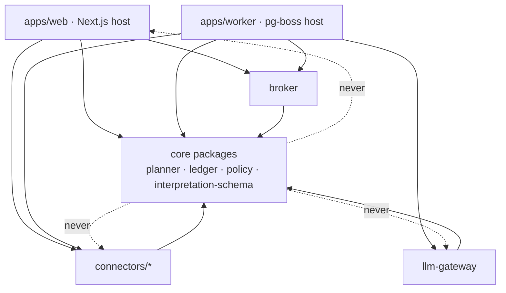
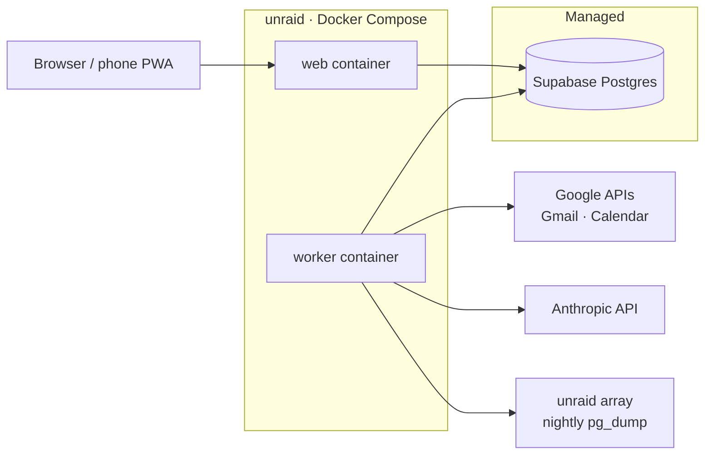
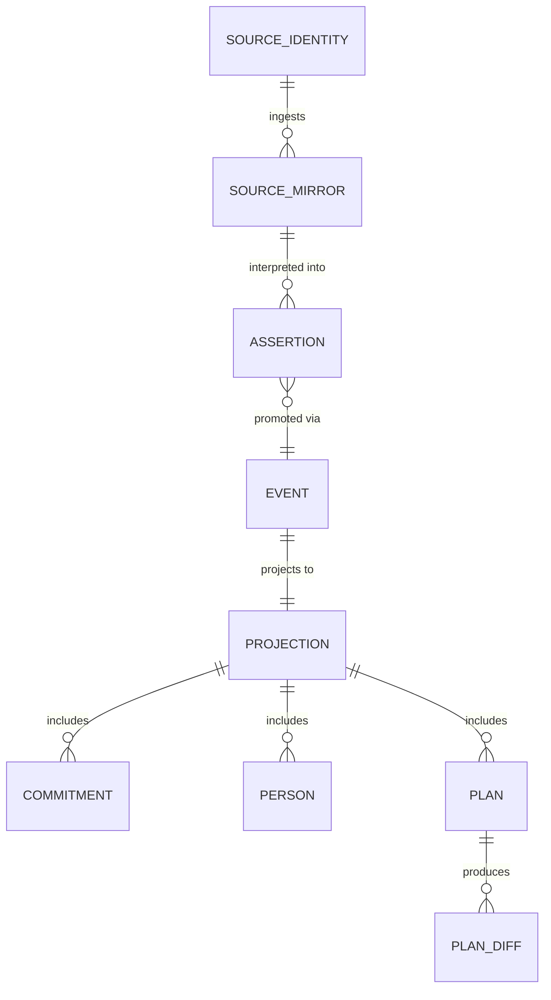

# Architecture Spine — Life Focus Intelligence

## Design Paradigm

**Hexagonal (ports & adapters) modular monolith.** A pure, deterministic domain core surrounded by adapters; the PRD's sense→interpret→decide→act→learn loop is the process model that runs *through* the hexagon, not the module structure.

- **Core packages** (framework-free TypeScript): `planner` (decide), `ledger` (domain state + audit), `interpretation-schema` (typed assertion contracts), `policy` (boundaries, protection levels, autonomy rules).
- **Adapters:** `connectors/*` (Gmail, Google Calendar — sense), `llm-gateway` (interpret), `broker` (cross-context output filter — act), `notify` (act).
- **Hosts** (thin, replaceable): `apps/web` (Next.js — UI + server actions), `apps/worker` (bare Node — pg-boss jobs).

## Invariants & Rules



### AD-1 — Adapters depend on core; core depends on nothing [ADOPTED]

- **Binds:** all
- **Prevents:** domain logic leaking into hosts/adapters until the planner can't be tested or reasoned about; framework churn forcing core rewrites.
- **Rule:** core packages import no adapter, host, framework, or I/O library. Adapters and hosts import core. Core defines port interfaces; adapters implement them. Intra-core direction: `planner` and `policy` may import types from `ledger` and `interpretation-schema`; never the reverse.

### AD-2 — The planner is a pure function

- **Binds:** FR-25–35, AC-4/5/8, NFR-1
- **Prevents:** two build sessions splitting planning logic between "the engine" and "some LLM call," making plans unexplainable and untestable.
- **Rule:** `planner` functions are pure: `(ContextSnapshot, PolicySet, now) → PlanProposal | PlanDiff`. No I/O, no LLM calls, no clock/random access inside — time is passed in. Every output carries the P11 consequence checklist and the FR-25 "why" facts as data. Because it is pure and cheap, **both hosts invoke it synchronously — there is no plan-cache layer at MVP**; proposals are ephemeral until approved, and approval persists the plan via AD-4. `ContextSnapshot` is a single named zod schema in `interpretation-schema` — no host or feature constructs its own variant. `PlanProposal`/`PlanDiff` are ephemeral values; the persisted `Plan` projection lives in `ledger` (see AD-4).

### AD-3 — LLM output enters through exactly one gate

- **Binds:** FR-15, FR-32/35, SM-14, OQ-1
- **Prevents:** scattered `client.messages.create` calls with divergent prompts, models, schemas, and no cost visibility; LLM text flowing into domain state unvalidated.
- **Rule:** all model calls go through `llm-gateway`, and **execute only in the worker host** as pg-boss jobs — `apps/web` appends a command (e.g. `CaptureReceived`) and observes the result via the DB; it never calls the model inline. (NFR-2's <10s interrupt budget is met by job pickup, not by bypassing the queue.) Model output becomes domain data only as **typed Assertions** (zod-validated, carrying `confidence`, `provenance` (source ref + model + prompt version), `context` tag) consumed via `interpretation-schema` contracts. Routing is config: extraction → `claude-haiku-4-5` (batch + prompt-cached), reasoning/explanation → `claude-sonnet-5`. Every call logs tokens + cost. Raw source content never reaches the planner. Both contexts' content may flow to the Anthropic API under no-training terms — this user-approved egress (2026-07-12) is distinct from SEC-2, which governs third-party-visible surfaces.

### AD-4 — All domain mutation is an appended command; state is a projection

- **Binds:** FR-21–24, FR-30, FR-46, NFR-3/4/5, SM-3/4/17
- **Prevents:** the Commitment Ledger, plan history, and audit trail drifting into three inconsistent mechanisms; undo becoming best-effort.
- **Rule:** domain writes append a command/event row to insert-only tables (`event_seq`, `event_type`, `actor`, `context`, `payload JSONB`, `caused_by`); current state lives in projection tables rebuilt from events. No `UPDATE`/`DELETE` on event tables, ever. The commitment ledger, plan-change history, and cross-context audit log are all this one mechanism. **Every command/event payload schema is defined exactly once, in `ledger`** — a feature needing `PersonCreated` imports it, never redeclares it. **All projections live in `ledger`**, including `Plan`. **Undo is always a compensating *forward* event** (`compensatesEventId` is audit linkage only, never consulted by projection logic — no negate-and-skip rebuilds).

### AD-5 — Every domain entity carries a context tag; `joint` is planning-only

- **Binds:** SEC-1/2, SM-17, AC-14, OQ-9
- **Prevents:** work and personal data joining silently, making the SEC-2 seam unauditable.
- **Rule:** `context ∈ {work, personal, joint}` is a non-null column on every domain entity. `joint` is legal only on planning-layer artifacts (plans, plan-diffs, capacity calculations) and user-initiated Person merges. Any output that leaves the authenticated app surface — drafts, notifications (they render on lock screens), future write-backs — passes the `broker` filter regardless of tag; every cross-context read/emit is an AD-4 audit event. **MVP broker scope = tag check + audit emit** (allow/deny by context rules); the constraint-only exchange engine is v1.0 (see Deferred).

### AD-6 — One app user; source identity = (provider, account, context) assigned at connect [ADOPTED]

- **Binds:** FR-13/14, OQ-3
- **Prevents:** context inferred from email addresses or domains, breaking when the same address serves both lives.
- **Rule:** context is a property of the *connection*, chosen by the user at connect time, immutable thereafter (reconnect to change). Person records merge across contexts only by explicit user action; the merge link is an audited event and the merged Person becomes `joint`.

### AD-7 — Connectors ingest; the ledger owns

- **Binds:** FR-13, FR-62, NFR-3, AC-15
- **Prevents:** a revoked token or upstream deletion erasing commitments; sync logic "cleaning up" domain state.
- **Rule:** connector data lands in source-mirror tables (cache semantics, safe to drop/rebuild). Promotion into domain state is an explicit AD-4 command. Connector failure may only lower confidence and flag staleness — never mutate or delete domain rows. Each connector records sync health the UI surfaces (FR-62).

### AD-8 — The only external write surface at MVP is Gmail draft creation [ADOPTED]

- **Binds:** FR-48/57, NFR-4, AC-10
- **Prevents:** autonomy scope creep — "just one calendar write" — before trust is earned.
- **Rule:** until v1.0 write-back ships, no adapter mutates any external system except creating drafts in the user's own Gmail. Sending is always human. Emotionally consequential communication always requires review (SEC-6), at every phase.

### AD-9 — The database is plain Postgres [ADOPTED]

- **Binds:** all persistence
- **Prevents:** Supabase-specific coupling making the DB unswappable.
- **Rule:** access via Drizzle over a standard connection string only. No Supabase Auth, client SDKs, realtime, or edge functions. Anything that must run in-database is vanilla SQL/pg extensions available on any managed Postgres. Nightly `pg_dump` (pg-boss job) to the unraid array is part of prod.

### AD-10 — Assertion conflicts resolve by the authority order, in one place

- **Binds:** FR-43/44, SM-14, addendum §4
- **Prevents:** two build sessions inventing different tie-breaking when sources disagree (calendar vs. email vs. user statement), making recommendations inconsistent and unexplainable.
- **Rule:** conflicting Assertions about the same fact resolve by the configurable authority order (user correction > operational status > approved decision > source-of-record > … > unverified inference, per addendum §4) implemented **once**, in core (`interpretation-schema`). Materially uncertain conflicts surface to the user (FR-44) rather than auto-resolving; the resolution is an AD-4 event.

## Consistency Conventions

| Concern | Convention |
| --- | --- |
| IDs | UUIDv7 everywhere, generated application-side (`uuidv7` npm package — Supabase runs PG 17, no native `uuidv7()` until PG 18); event tables also carry a monotonic `event_seq` bigint |
| Time | ISO-8601 UTC in storage and payloads; user timezone applied at render only; durations are integer minutes |
| Events / commands | Commands imperative (`AcceptCommitment`), events past-tense (`CommitmentAccepted`); payloads zod-validated |
| Boundary validation | Every adapter→core payload crosses a zod schema defined in core (`interpretation-schema`); hosts never construct domain objects by hand |
| Errors | Core throws typed domain errors; hosts map to UI/job outcomes; adapters never swallow — failures become sync-health events |
| Naming | Packages kebab-case; domain types match PRD glossary terms exactly (Commitment, Assertion, PlanDiff, ProtectionLevel) |
| Config & secrets | `.env` per environment (compose `env_file`, never committed), loaded once at host startup, typed via a single `config` module; no `process.env` reads outside it |
| Web mutations | UI mutations are Next.js server actions that append AD-4 commands; API route handlers exist only for OAuth callbacks and webhooks |
| Jobs & failure | pg-boss jobs defined in `apps/worker` only, handlers thin over core; retries with backoff via pg-boss `retryLimit`; exhausted jobs land in the dead-letter queue AND emit a sync-health event surfaced in-app (FR-62) — no silent failure |
| Testing | Vitest; co-located `*.test.ts`; `planner` logic (AC-5/8) covered by pure unit tests; integration tests run against an ephemeral Postgres container; job handlers tested by direct invocation, not through the queue |
| Auth | Better Auth in `apps/web`; worker trusts the DB boundary (single-tenant) |
| Accessibility (NFR-7) | Semantic HTML + keyboard operability by default; status never conveyed by color alone; `eslint-plugin-jsx-a11y` in the lint gate |
| Mobile (NFR-9, AC-6) | `apps/web` ships responsive layouts + PWA manifest from MVP — capture must work from a phone browser; only push-notification transport is deferred |

## Stack

| Name | Version |
| --- | --- |
| TypeScript | 7.x (strict) |
| Node.js | 24 LTS |
| Next.js | 16.2 |
| Drizzle ORM | 0.45.x (pin until 1.0 stable) |
| pg-boss | 12.x |
| Better Auth | current stable at scaffold time |
| zod | 4.x |
| Anthropic TS SDK | current stable; models `claude-haiku-4-5`, `claude-sonnet-5` via config |
| Postgres | Supabase-provisioned major; dev container pinned to match |
| Docker Compose | prod on unraid; dev anywhere |

## Structural Seed

```text
life-focus/
  apps/
    web/                 # Next.js 16 host: UI, server actions, Better Auth
    worker/              # bare-Node host: pg-boss jobs (sync, extraction, plan-prep, backup)
  packages/
    planner/             # pure decide: capacity math, plan-diff, P11 checklist
    ledger/              # event append + projections + undo
    policy/              # protection levels, boundaries, autonomy rules
    interpretation-schema/ # zod contracts: Assertion, typed extraction shapes
    broker/              # cross-context output filter (SEC-2)
    connectors/          # gmail/, gcal/ (v0.2+: slack/, jira/)
    llm-gateway/         # model routing, cost log, prompt versions
    db/                  # drizzle schema, migrations
    config/              # typed env access
```



**Environments:** `dev` = docker compose with local Postgres container (major pinned to prod); `prod` = unraid compose + Supabase. Google OAuth app runs in personal-use/unverified mode (single-tenant; no CASA). Sync health is surfaced in-app (FR-62); no external monitoring at MVP.



## Capability → Architecture Map

| Capability / Area | Lives in | Governed by |
| --- | --- | --- |
| Life model, policies (FR-1–7) | `policy` + `ledger` | AD-4, AD-5 |
| People & relationships (FR-8–12) | `ledger` (Person projections) | AD-5, AD-6 |
| Ingestion (FR-13–16) | `connectors/*` → mirrors | AD-6, AD-7 |
| Capture (FR-17–20) | `apps/web` → AD-4 commands | AD-4 |
| Commitment Ledger (FR-21–24) | `ledger` | AD-4 |
| Prioritization/capacity/planning (FR-25–35) | `planner` | AD-1, AD-2 |
| Extraction & assertions (FR-15, 41–46) | `llm-gateway` + `interpretation-schema` | AD-3 |
| Execution & drafts (FR-47–51) | `apps/web` + gmail connector | AD-8 |
| Notifications (FR-56) | `notify` via worker | AD-5 (broker) |
| Autonomy & audit (FR-57–59) | `policy` + `ledger` events | AD-4, AD-8 |
| Coverage & degradation (FR-60–62) | connector sync-health + UI | AD-7 |
| Privacy seam (SEC-1–6) | context tags + `broker` | AD-5, AD-6 |
| Interface surfaces (FR-67–68) | `apps/web` routes per surface | AD-1 |

## Deferred

- **Slack/Jira/task-app/Apple connectors (v0.2/v0.4)** — new adapters under AD-7; no new invariants expected. iMessage has no supported API (verified 2026-07); unofficial `chat.db` reading is a v0.4+ spike, not a commitment.
- **Learning-loop storage & calibration model (v0.3)** — learned assumptions are AD-4 events with expiry; detailed schema waits for real usage data.
- **Broker hardening to full v1.0 semantics** — MVP ships tag + audit (AD-5); constraint-only exchange rules distill when third-party-visible surfaces multiply.
- **Notification transport** — in-app only at MVP; push/PWA transport chosen when mobile usage is real.
- **Estimation defaults (OQ-2)** — user-input + per-type template values; tuning belongs to the learning loop.
- **Multi-user / commercial deployment (OQ-7, Phase 3+)** — single-tenant assumptions (worker trusts DB boundary) are marked here so they're findable, not accidental, when this reopens.
- **Observability beyond in-app sync health** — add when the system runs unattended long enough to need it.
- **Plan-projection rebuild strategy** — full replay vs. snapshotting decided when event volume makes it interesting; schema (AD-4) supports either.
